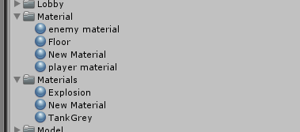

# 文件夹
__Scene
游戏所要用到的所有场景

_Loading
(_Loading)场景所需要的所有文件

_StartMenu
(_StartMenu)场景所需要的所有文件

Audio 音效
Fronts 字体
Tank Tank所需要的所有文件，包括素材

**Asset**
下面几个文件夹是插件  
没什么问题的话尽量不要动它  
- Lobby 插件 Network Lobby
- Behavior Designer
- SimpleDungeons 总的场景
- Big Toon... 坦克素材

# Log
## 2018/7/8
调了整个文件夹的结构
主要
 - 把StartMenu和Loading的内容放在两个文件夹下
 - 把散落在各地的UI的文件和代码收拾了一下
 - 把挂在场景里面的代码都拖了出来
 - 
## 2018/7/9
上面10的那个整个场景的Scene被我锁了免得不小心碰到
如果想要操作场景解锁就行

加了Occlusion Culling遮挡裁剪

# TODO
## 车辆的仿真  
运动起来贴图的变化 轮子转动 这个可以直接抠图然后运动起来变贴图  
还有如何模拟坦克的仿真  现在是直接调整位置而不是靠摩擦力的
因为地形还有台阶所以这个要怎么处理还是个问题

然后因为场景比较复杂的话，可能还要考虑比较多的情况
加 Wheel Collider  
不同位置受到攻击的处理  

## 攻击仿真
攻击方式主要是导弹和敌方AI。现在还没有想好地对空和空对地的攻击怎么设置
需要找找插件
https://blog.csdn.net/qq_28221881/article/details/53747565

## AI
### 游戏中的简单决策
**决策树**
还涉及一些动画的处理,然后还要用到寻路
因为要是要做中间那个场景的话中间有一块凹下去的要靠台阶跳上来的部分

### 机器学习
这个还有蛮多的  一个增强学习一个模仿学习都还不会  
先找最简单的场景实现了再说
这个主要应用于对战

## 生成地图
这个的难点应该在于如何交互的生成场景  
相比之下文件读取什么的反而不难

文件读取
选取存储地图位置
FolderBrowserDialog

## 联机
联机之后如果要自己选择飞机还是坦克应该怎么做
以及地图选择

## 资源打包
AssetBundles
（这个发现可能不需要）

## Shader
很想做这个但是感觉要没时间做了！啊——

## 过场动画

~~要稍微了解一下异步加载的机制然后把动画加进去
~~ 
（这个好像已经做好了）
