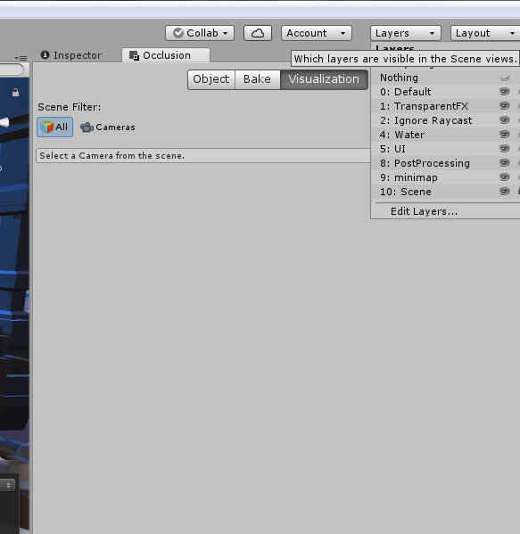

# 文件夹
__Scene
游戏所要用到的所有场景

_Loading
(_Loading)场景所需要的所有文件

_StartMenu
(_StartMenu)场景所需要的所有文件

AudioClips
音效

Fronts
字体

Tank
Tank所需要的所有文件，包括素材
这个文件被我卸了很多

## Asset
下面几个文件夹是插件  
没什么问题的话尽量不要动它  
- - Lobby 插件 Network Lobby
- Behavior Designer
- SimpleDungeons
总的场景

# 提醒
文件夹合的清楚一点
下面这种东西就不要出来了
这次就默认是合代码的时候的问题了

摆脱不要再把自己的代码分好几个文件夹了
特别是UI

然后还有报告可以开始写了
